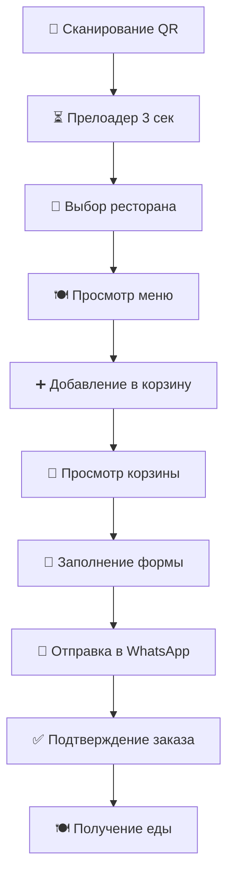
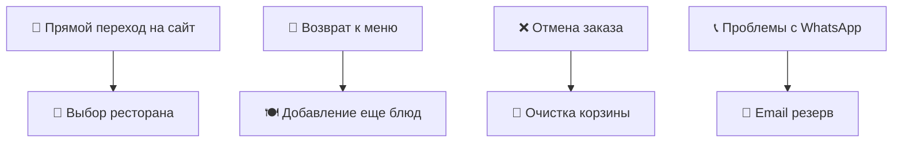
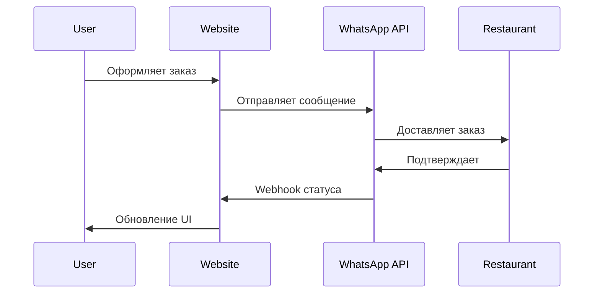

# 🏗 Архитектура системы QR-меню

## 📋 Обзор системы

```
┌─────────────────────────────────────────────────────────────────┐
│                    🍽 QR MENU ECOSYSTEM                        │
├─────────────────────────────────────────────────────────────────┤
│                                                                 │
│  📱 QR-код → 🌐 Веб-сайт → 🛒 Заказ → 💬 WhatsApp → 🏪 Ресторан │
│                                                                 │
└─────────────────────────────────────────────────────────────────┘
```

## 🎯 Пользовательские роли

### 👤 Гость ресторана
```
🔍 Сканирует QR-код
👀 Просматривает меню  
🛒 Добавляет в корзину
📝 Оформляет заказ
💬 Получает подтверждение
```

### 👨‍🍳 Персонал ресторана
```
📱 Получает заказы в WhatsApp
✅ Подтверждает заказ
👨‍🍳 Готовит блюда
🚚 Доставляет на стол
```

### 👨‍💼 Администратор
```
📊 Управляет меню
🏪 Настраивает рестораны
📈 Просматривает статистику
🎨 Генерирует QR-коды
```

## 🗺 Карта пользовательских сценариев

### 🛤 Основной путь (Happy Path)


### 🔀 Альтернативные сценарии


## 🏗 Техническая архитектура

### Frontend (Next.js 15)
```
📁 app/
├── 🎨 globals.css                   # Глобальные стили
├── 🏠 layout.tsx                    # Главный layout
├── 🌟 page.tsx                      # Главная с выбором ресторана
├── ⏳ loading.tsx                   # Прелоадер
├── 🚫 not-found.tsx                 # 404 страница
├── 🏪 restaurant/
│   └── [id]/
│       ├── 📄 page.tsx              # Меню ресторана
│       ├── 🛒 cart/
│       │   └── 📄 page.tsx          # Корзина
│       └── 📋 order/
│           ├── 📄 page.tsx          # Оформление заказа
│           └── ✅ success/
│               └── 📄 page.tsx      # Успешный заказ
├── 👨‍💼 admin/
│   ├── 📊 dashboard/
│   ├── 🍽 menu/
│   ├── 🏪 restaurants/
│   ├── 📱 orders/
│   └── 🎨 qr-generator/
└── 🔌 api/
    ├── 🏪 restaurants/
    ├── 🍽 menu/
    ├── 📋 orders/
    └── 🎯 webhooks/
```

### Компоненты
```
📁 components/
├── 🎨 UI/
│   ├── Button.tsx
│   ├── Card.tsx
│   ├── Modal.tsx
│   └── Toast.tsx
├── ⏳ Loading/
│   ├── Preloader.tsx               # Главный прелоадер
│   ├── SkeletonCard.tsx            # Скелетоны карточек
│   └── LoadingSpinner.tsx          # Спиннеры
├── 🏪 Restaurant/
│   ├── RestaurantCard.tsx          # Карточка ресторана
│   ├── RestaurantSelector.tsx      # Выбор ресторана
│   └── RestaurantHeader.tsx        # Хедер ресторана
├── 🍽 Menu/
│   ├── CategoryCard.tsx            # Карточка категории
│   ├── DishCard.tsx                # Карточка блюда
│   └── MenuFilter.tsx              # Фильтры меню
├── 🛒 Cart/
│   ├── CartButton.tsx              # Плавающая кнопка
│   ├── CartModal.tsx               # Модальное окно
│   ├── CartItem.tsx                # Элемент корзины
│   └── CartSummary.tsx             # Итоги
├── 📋 Order/
│   ├── OrderForm.tsx               # Форма заказа
│   ├── OrderSummary.tsx            # Сводка заказа
│   └── OrderSuccess.tsx            # Страница успеха
├── 📱 QR/
│   ├── FoodQRCode.tsx              # QR в виде еды
│   └── QRGenerator.tsx             # Генератор QR
└── 🔔 Notifications/
    ├── Toast.tsx                   # Уведомления
    └── OrderStatus.tsx             # Статус заказа
```

## 📊 Управление состоянием

### Context API структура
```typescript
// contexts/
├── RestaurantContext.tsx           # Выбранный ресторан
├── CartContext.tsx                 # Состояние корзины  
├── OrderContext.tsx                # Процесс заказа
└── ThemeContext.tsx                # Тема приложения

interface CartState {
  items: CartItem[]                 # Товары в корзине
  total: number                     # Общая сумма
  restaurant: Restaurant            # Выбранный ресторан
  table?: string                    # Номер стола
}

interface OrderState {
  customerInfo: CustomerInfo        # Данные клиента
  deliveryInfo?: DeliveryInfo       # Информация о доставке
  status: OrderStatus               # Статус заказа
  paymentMethod: PaymentMethod      # Способ оплаты
}
```

### LocalStorage схема
```javascript
// Структура данных в LocalStorage
{
  "restaurant_selection": "kemine-bistro",
  "cart_items": [
    {
      "id": "dish_1",
      "name": "Маргарита",
      "price": 400,
      "quantity": 2,
      "options": ["без лука"]
    }
  ],
  "user_preferences": {
    "language": "ru",
    "theme": "light"
  },
  "order_history": [
    {
      "orderId": "order_123",
      "date": "2025-10-03",
      "total": 800,
      "status": "completed"
    }
  ]
}
```

## 🔌 API архитектура

### REST Endpoints
```
GET    /api/restaurants              # Список ресторанов
GET    /api/restaurants/[id]         # Данные ресторана
GET    /api/restaurants/[id]/menu    # Меню ресторана
POST   /api/orders                   # Создание заказа
GET    /api/orders/[id]              # Статус заказа
POST   /api/webhooks/whatsapp        # Webhook WhatsApp
POST   /api/webhooks/telegram        # Webhook Telegram
GET    /api/qr/generate              # Генерация QR
```

### Схемы данных
```typescript
interface Restaurant {
  id: string
  name: string
  description: string
  image: string
  rating: number
  isOpen: boolean
  workingHours: string
  contacts: Contact[]
  location: string
  menu: Category[]
}

interface Category {
  id: string
  name: string
  description?: string
  image: string
  dishes: Dish[]
}

interface Dish {
  id: string
  name: string
  description: string
  price: number
  image: string
  isAvailable: boolean
  options?: DishOption[]
  allergens?: string[]
}

interface Order {
  id: string
  restaurant: Restaurant
  customer: CustomerInfo
  items: OrderItem[]
  total: number
  status: 'pending' | 'confirmed' | 'preparing' | 'ready' | 'delivered'
  table?: string
  specialRequests?: string
  createdAt: Date
  estimatedTime?: number
}
```

## 🔄 Интеграции

### WhatsApp Business API


### Telegram Bot (резерв)
```javascript
// telegram/bot.js
const TelegramBot = require('node-telegram-bot-api')

class RestaurantBot {
  constructor(token) {
    this.bot = new TelegramBot(token, { polling: true })
    this.setupCommands()
  }

  async sendOrder(chatId, order) {
    const message = this.formatOrderMessage(order)
    return await this.bot.sendMessage(chatId, message, {
      parse_mode: 'Markdown',
      reply_markup: {
        inline_keyboard: [
          [{ text: '✅ Принять', callback_data: `accept_${order.id}` }],
          [{ text: '❌ Отклонить', callback_data: `reject_${order.id}` }]
        ]
      }
    })
  }
}
```

## 📱 Мобильная оптимизация

### Responsive Breakpoints
```css
/* Mobile First подход */
.menu-grid {
  display: grid;
  gap: 1rem;
  
  /* Mobile: 1 колонка */
  grid-template-columns: 1fr;
  
  /* Tablet: 2 колонки */
  @media (min-width: 640px) {
    grid-template-columns: repeat(2, 1fr);
  }
  
  /* Desktop: 3 колонки */
  @media (min-width: 1024px) {
    grid-template-columns: repeat(3, 1fr);
  }
}
```

### Touch оптимизация
```css
/* Минимальные размеры для касания */
.touch-target {
  min-height: 44px;    /* iOS стандарт */
  min-width: 44px;
  padding: 12px;
}

/* Увеличенные кнопки для важных действий */
.primary-button {
  min-height: 56px;    /* Material Design */
  font-size: 16px;     /* Предотвращает zoom на iOS */
}
```

## 🔐 Безопасность

### Валидация данных
```typescript
// utils/validation.ts
export const orderValidation = {
  customerName: (name: string) => {
    return name.trim().length >= 2 && name.length <= 50
  },
  
  phone: (phone: string) => {
    const phoneRegex = /^\+996\d{9}$/
    return phoneRegex.test(phone)
  },
  
  orderItems: (items: CartItem[]) => {
    return items.length > 0 && items.every(item => 
      item.quantity > 0 && item.price > 0
    )
  }
}
```

### Rate Limiting
```javascript
// middleware/rateLimit.js
export const orderRateLimit = {
  windowMs: 15 * 60 * 1000,    // 15 минут
  max: 5,                       // максимум 5 заказов
  message: 'Слишком много заказов. Попробуйте позже.'
}
```

## 📈 Аналитика

### Метрики производительности
```javascript
// utils/analytics.js
export const trackEvents = {
  qrScanned: (restaurantId, table) => {
    // Google Analytics / Yandex Metrica
    gtag('event', 'qr_scanned', {
      restaurant: restaurantId,
      table: table,
      timestamp: Date.now()
    })
  },
  
  orderCompleted: (orderId, total, items) => {
    gtag('event', 'purchase', {
      transaction_id: orderId,
      value: total,
      currency: 'KGS',
      items: items
    })
  }
}
```

### KPI Dashboard
```
📊 Ключевые метрики:
├── 📱 QR сканирования/день
├── 🏪 Выбор ресторана (конверсия)
├── 🛒 Добавления в корзину
├── 💰 Завершенные заказы
├── 💵 Средний чек
├── ⏱ Время от QR до заказа
└── 📞 Способы связи (WhatsApp/Telegram)
```

## 🚀 Deployment

### Production Infrastructure
```yaml
# docker-compose.yml
version: '3.8'
services:
  nextjs:
    build: .
    ports:
      - "3000:3000"
    environment:
      - NODE_ENV=production
      - NEXT_PUBLIC_BASE_URL=https://qrmenu.kg
      
  nginx:
    image: nginx:alpine
    ports:
      - "80:80"
      - "443:443"
    volumes:
      - ./nginx.conf:/etc/nginx/nginx.conf
      - ./ssl:/etc/ssl/certs
```

### CI/CD Pipeline
```yaml
# .github/workflows/deploy.yml
name: Deploy to Production
on:
  push:
    branches: [main]
    
jobs:
  deploy:
    runs-on: ubuntu-latest
    steps:
      - uses: actions/checkout@v3
      - uses: actions/setup-node@v3
        with:
          node-version: '18'
      - run: npm ci
      - run: npm run build
      - run: npm run test
      - name: Deploy to server
        run: |
          rsync -av dist/ user@server:/var/www/qrmenu/
```

Готов к реализации! 🚀 С какого компонента начнем?