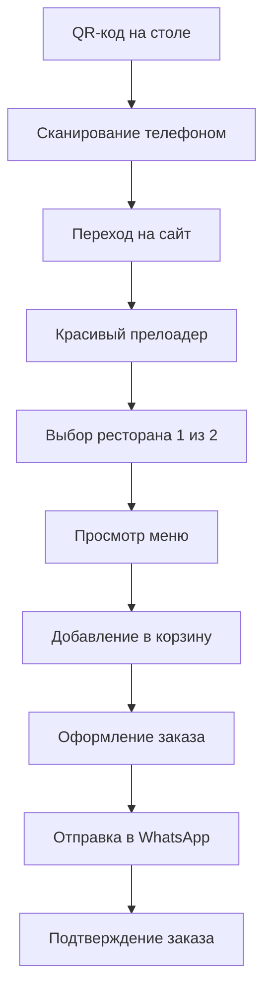
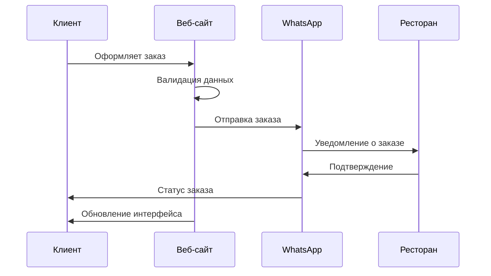

# 📋 План разработки и архитектура проекта

## 🎯 Обзор проекта

**Цель:** Создание системы QR-меню для ресторанов с возможностью заказа через мессенджеры.

**Основной flow:** QR-код → Прелоадер → Выбор ресторана → Меню → Заказ → Отправка в WhatsApp/Telegram

---

## 🏗 Архитектура системы

### 📱 Пользовательский Journey Map



### 🗂 Структура маршрутов

```
📁 app/
├── 📄 page.tsx                    # Главная - выбор ресторана с прелоадером
├── 📁 restaurant/
│   └── 📁 [id]/
│       ├── 📄 page.tsx            # Меню ресторана
│       ├── 📁 cart/
│       │   └── 📄 page.tsx        # Корзина заказов
│       ├── 📁 order/
│       │   ├── 📄 page.tsx        # Оформление заказа
│       │   └── 📁 success/
│       │       └── 📄 page.tsx    # Успешный заказ
├── 📁 admin/                      # Существующая админ панель
└── 📁 api/
    ├── 📁 restaurants/
    ├── 📁 orders/
    └── 📁 webhooks/
```

### 🧩 Компоненты системы

#### **Основные компоненты:**
```
📁 components/
├── 🎨 Loader/
│   ├── Preloader.tsx              # Главный прелоадер
│   ├── SkeletonCard.tsx           # Скелетоны для карточек
│   └── LoadingSpinner.tsx         # Спиннеры загрузки
├── 🏪 Restaurant/
│   ├── RestaurantCard.tsx         # Карточка ресторана
│   ├── RestaurantSelector.tsx     # Выбор ресторана
│   └── RestaurantInfo.tsx         # Информация о ресторане
├── 🛒 Cart/
│   ├── CartButton.tsx             # Плавающая кнопка корзины
│   ├── CartModal.tsx              # Модальное окно корзины
│   ├── CartItem.tsx               # Элемент корзины
│   └── CartSummary.tsx            # Итоги корзины
├── 📋 Order/
│   ├── OrderForm.tsx              # Форма заказа
│   ├── OrderSummary.tsx           # Сводка заказа
│   ├── OrderSuccess.tsx           # Страница успеха
│   └── OrderTracking.tsx          # Отслеживание заказа
└── 🔔 Notifications/
    ├── Toast.tsx                  # Уведомления
    └── OrderStatus.tsx            # Статус заказа
```

---

## 🎨 QR-код в виде еды

### 💡 Концепция креативных QR-кодов

QR-коды можно стилизовать под еду, сохраняя функциональность:

#### **Варианты дизайна:**

1. **🍕 Пицца QR-код:**
   - Круглая форма
   - QR-паттерн как начинка
   - Цвета: красный, желтый, зеленый

2. **🍔 Бургер QR-код:**
   - Слоистая структура
   - QR-код в средней части
   - Реалистичные цвета булочки

3. **🍰 Торт QR-код:**
   - Многоярусный дизайн
   - QR-паттерн как украшение
   - Пастельные цвета

4. **☕ Кофе QR-код:**
   - Форма чашки
   - QR-код в пенке
   - Коричневые оттенки

### 🛠 Технические требования для QR-кодов:

```javascript
// Параметры QR-кода
{
  size: 300x300,           // Минимальный размер для сканирования
  errorCorrection: 'H',    // Высокий уровень коррекции ошибок (30%)
  margin: 4,               // Отступы для надежного сканирования
  customization: {
    logo: true,            // Можно добавить логотип в центр
    colors: true,          // Кастомные цвета
    shapes: 'rounded'      // Округлые углы
  }
}
```

### 📱 Как работает QR-код:

1. **Генерация:** 
   ```
   https://yoursite.com/restaurant/kemine-bistro?table=5&qr=abc123
   ```

2. **Параметры URL:**
   - `restaurant` - ID ресторана
   - `table` - номер стола (опционально)
   - `qr` - уникальный код для аналитики

3. **Сканирование:**
   - Камера телефона → QR-код → Автоматический переход в браузер

---

## 🚀 Этапы разработки

### **Фаза 1: Подготовка (1-2 дня)**
- [x] Обновление архитектуры проекта
- [ ] Создание компонента прелоадера
- [ ] Дизайн QR-кодов в виде еды
- [ ] Настройка новых маршрутов

### **Фаза 2: Выбор ресторана (1 день)**
- [ ] Страница выбора ресторанов
- [ ] Анимации переходов
- [ ] Адаптивный дизайн
- [ ] Интеграция с прелоадером

### **Фаза 3: Система корзины (2-3 дня)**
- [ ] Логика добавления в корзину
- [ ] LocalStorage для сохранения
- [ ] Плавающая кнопка корзины
- [ ] Модальное окно корзины
- [ ] Расчет итоговой суммы

### **Фаза 4: Система заказов (2-3 дня)**
- [ ] Форма оформления заказа
- [ ] Валидация данных
- [ ] Страница подтверждения
- [ ] Интеграция с WhatsApp API
- [ ] Резервный канал (Telegram/Email)

### **Фаза 5: Интеграции (1-2 дня)**
- [ ] WhatsApp Business API
- [ ] Telegram Bot
- [ ] SMS уведомления
- [ ] Email подтверждения

### **Фаза 6: Админ панель (1-2 дня)**
- [ ] Управление заказами
- [ ] Статистика по QR-кодам
- [ ] Настройки ресторанов
- [ ] Генератор QR-кодов

### **Фаза 7: Тестирование и оптимизация (1-2 дня)**
- [ ] Тестирование на разных устройствах
- [ ] Оптимизация производительности
- [ ] SEO оптимизация
- [ ] Исправление багов

---

## 📊 Техническая спецификация

### **Frontend Stack:**
- **Framework:** Next.js 15 (App Router)
- **Styling:** Tailwind CSS + Custom CSS
- **State Management:** React Context + LocalStorage
- **Animations:** Framer Motion (рекомендуется)
- **Icons:** Lucide React
- **QR Generation:** qrcode.js или qr-code-generator

### **Backend/API:**
- **API Routes:** Next.js API Routes
- **Database:** JSON файлы (текущее) → MongoDB/PostgreSQL (будущее)
- **File Upload:** Для изображений блюд
- **Webhooks:** Для обработки статусов заказов

### **Интеграции:**
- **WhatsApp Business API:** Основной канал заказов
- **Telegram Bot API:** Резервный канал
- **SMS Gateway:** Twilio/СМС.ру
- **Email Service:** Nodemailer/SendGrid
- **Analytics:** Google Analytics для QR-кодов

### **Производительность:**
- **Caching:** Next.js ISR для статических данных
- **Images:** Next.js Image Optimization
- **Bundle Size:** Анализ и оптимизация
- **Loading:** Progressive loading для меню

---

## 🔄 Система заказов

### **Схема обработки заказа:**



### **Формат заказа для WhatsApp:**

```
🍽 НОВЫЙ ЗАКАЗ #1234

🏪 Ресторан: Kemine Bistro
📱 Клиент: Иван Иванов (+996 555 123 456)
🪑 Стол: №5

📋 ЗАКАЗ:
🍕 Маргарита x2 - 800 сом
🥤 Кока-кола x1 - 80 сом
🍰 Тирамису x1 - 200 сом

💰 ИТОГО: 1080 сом

📝 Комментарий: Без лука в салате
🕐 Время заказа: 14:30
```

---

## 📈 Аналитика и метрики

### **Отслеживаемые события:**
- Сканирования QR-кодов по ресторанам
- Переходы между страницами
- Добавления в корзину
- Оформленные заказы
- Источники трафика
- Время сессии

### **KPI проекта:**
- **Conversion Rate:** QR-скан → Заказ
- **Average Order Value:** Средний чек
- **User Journey:** Время от скана до заказа
- **Error Rate:** Количество ошибок в процессе

---

## 🛡 Безопасность

### **Меры безопасности:**
- Валидация всех входных данных
- Rate limiting для API
- HTTPS обязательно
- Защита от XSS и CSRF
- Безопасное хранение данных клиентов

### **Приватность:**
- Минимальный сбор данных
- Согласие на обработку
- Возможность удаления данных
- Соответствие GDPR (если нужно)

---

## 🎯 Следующие шаги

1. **Утвердить архитектуру** и план разработки
2. **Выбрать дизайн QR-кодов** (какую еду использовать)
3. **Определить способ отправки заказов** (WhatsApp/Telegram)
4. **Начать с создания прелоадера** и выбора ресторанов

**Готов начать реализацию! Какой этап хотите запустить первым?** 🚀